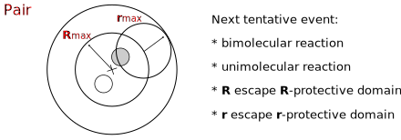

## Green’s Function Reaction Dynamics
A reaction-diffusion system is a many-body problem that cannot be solved analytically. The key idea of GFRD is to decompose the many-body problem into one- and two-body problems that can be solved analytically via Green’s functions, and use these Green’s functions to set up an event-driven algorithm \[[1,2](#references)\]. The Green’s functions allow GFRD to make large jumps in time and space when the particles are far apart from each other. 

In the original version of the algorithm, the many-body problem was solved by determining at each step of the simulation a maximum time step such that each particle could interact with at most one other particle during that time step \[[1,2](#references)\]. Although already up to five orders more efficient than conventional Brownian Dynamics \[[1](#references)\] and also very accurate by its own right, the original GFRD algorithm has three drawbacks: (1) Because of the synchronous nature, the decomposition into one and two-body problems has to happen at every simulation step; (2) All components in the system are propagated according to the smallest tentative reaction time, making the performance sub-optimal; (3) the decomposition into single particles and pairs of particles involves cut-off distances, which makes the algorithm inexact; the systematic error is controlled by a parameter that determines the probability that during a time step a particle travels a distance further than the maximum distance set by the requirement that each particle can interact with at most one other particle; this means that there is a trade-off between performance and error.

In the new version of the algorithm, we overcome the drawbacks of the original algorithm by implementing ideas of Opplestrup and coworkers \[[3](#references)\]. In this new scheme, protective domains are put around single particles and pairs of particles, as shown in Fig. 1. For each of the domains, the reaction-diffusion problem is solved analytically using Green’s functions. This yields for each domain an event type and an event time; as described below, the set of possible event types depends on whether the domain is a Single, meaning it contains a single particle, or a Pair, meaning it contains a pair of particles. The event times are put in a chronologically ordered event list, and the events are then executed in chronological order. When an event is executed, the particles of the corresponding domain are propagated, for the propagated particles new domains, with new event types and new event times, are determined, and the new events are put back in the event list. The new version of GFRD, called eGFRD, is thus an exact, event-driven, asynchronous algorithm. Its asynchronous nature makes eGFRD similar in spirit to the Gibson-Bruck scheme, which is an exact, event-driven asynchronous algorithm for simulating the zero-dimensional chemical master equation \[[4](#references)\]. A movie of eGFRD in action is shown in Movie 1.

Fig.1: Overview of GFRD. The principal idea of GFRD is to decompose the many-body reaction-diffusion problem into one- and two-body problems that can be solved analytically using Green’s Functions. To this end, protective domains are put around single particles and pairs of particles, leading to so-called Singles and Pairs, respectively. For each domain, a next event type and a next event time is determined. The event times are put in a chronologically ordered event list, and the events are then executed in chronological order. When an event is executed, the particles of the corresponding domain are propagated, new domains with new events are determined, and the events are put back in the event list.

 
 

    

Movie 1. A movie of eGFRD in action. The yellow spheres are protective domains for single particles, while the green spheres are protective domains for pairs of particles. 

## Single
A Single is a domain that contains only a single particle. The next event type is either a unimolecular reaction of the type A ⇾ B + C + … or A ⇾ Ø, or an escape from the domain, as sketched in Fig. 1. To determine which of the two possible events will occur, a tentative event time is determined for each of them; the event with the smallest tentative event time is the one that will occur for that domain; it is the one that is put in the event list.

Fig.2: A Single, a protective domain that contains only a single particle. The possible event types are either a unimolecular reaction or the escape of the single particle from the protective domain.

## Pair
A Pair is a domain that contains a pair of particles. The reaction-diffusion problem of two particles that can react with each other and diffuse in a spherical domain with absorbing boundary conditions can, to our knowledge, not be solved analytically. We therefore apply a coordinate transformation leading to a diffusion problem for the center-of-mass coordinate <b>R</b> and a reaction-diffusion problem for the inter-particle vector <b>r</b>, as sketched in Fig. 3. The event types that can occur are <b>R</b> leaving its domain, <b>r</b> leaving its domain, a unimolecular reaction or a bimolecular reaction. For each of these events a tentative event time is determined, and the event with the smallest tentative event time is the one that will happen, and put in the event list. 

Fig.3: A Pair, a protective domain that contains a pair of particles. A coordinate transformation is applied, and one protective domain is defined for the center-of-mass coordinate <b>R</b> and one for the inter-particle vector  <b>r</b>. The sizes of these domains are determined such that when both <b>R</b> and <b>r</b> would reach their maximum values, |<b>R</b>|max and |<b>r</b>|max, respectively, the two particles would still be within the original protective domain. The dynamics of <b>R</b> is a diffusion problem of a random walker in a spherical domain with absorbing boundary conditions. The dynamics of <b>r</b> takes into account that the two particles not only diffuse, but can also react with each other; this is the problem of a random walker between two concentric spherical surfaces, with a radiation boundary condition at the inner surface, describing the bimolecular reaction, and an adsorbing boundary condition at the outer surface, describing the escape from the domain. The next event is thus either the escape of <b>R</b> from its domain, the escape of <b>r</b> from its domain, a bimolecular reaction, or a unimolecular reaction.

## Performance
Fig.4 shows the power of eGFRD. Plotted is the CPU time for simulating a system consisting of hard spheres for a fixed amount of real time as a function of the number of particles N, for two scenarios: one in which the concentration C is kept constant (solid line) and one in which the volume V is kept constant (dashed lines). For comparison, two curves (in blue) obtained with Brownian Dynamics (BD) are also shown: one corresponding to a BD simulation with a conventional, small time step of  
δt = 10-6σ2/D, and one corresponding to a (relaxed) BD simulation using a relatively large time step of δt = 10-3σ2/D. It is seen that the CPU time of eGFRD scales linearly with N when the concentration is constant, as in BD; this is because a cell list is used for determining which particles or domains interact with a given particle or domain. However, the CPU time of eGFRD scales with N5/3 when the volume is kept constant. This can be understood by noting that the CPU time scales with N/<Δt>, where <Δt> is the magnitude of the average time step in the eGFRD simulations; the size of the average time step scales as <Δt> ~ 1 / l2 ~ N2/3, where l is the average distance between the particles.  Indeed, when N is increased while V is kept constant, the concentration C increases and the average distance between the particles decreases. This decreases the jumps in time and space that can be made during the eGFRD simulations. Since the CPU time of BD scales with N wile that of eGFRD scales with N5/3 when V is constant, there is a concentration above which BD becomes more efficient than eGFRD. This is demonstrated in the inset of Fig.4. It is seen that the cross-over occurs at mM concentration. However, the concentrations of components in signal transduction pathways are typically in the μM range, while those in gene regulation networks are typically in the nM range. Under these biologically relevant conditions, eGFRD is up to 6 orders of magnitude more efficient than BD.

Fig.4. CPU time for simulating a system of hard spheres for a fixed amount of real time as a function of the number of particles N for two scenarios: one in which the concentration C is kept constant (solid line), and one in which the volume V is kept constant (dashed line). For comparison, we also show the results for BD simulations (blue curves), with one curve corresponding to a simulation with a conventional small time step of  
δt = 10-6σ2/D, and one corresponding to a (relaxed) BD simulation using a relatively large time step of δt = 10-3σ2/D. The inset shows the CPU time as a function of the concentration C, for N=300 and N=3000 (the volume is thus varied). It is seen that above mM concentrations, BD is more efficient than eGFRD. However, in the biologically relevant concentration range of nM to μM eGFRD can be up to 6 orders of magnitude more efficient than conventional BD.

## References
1. Van Zon JS, Ten Wolde PR (2005) Simulating biochemical networks at the particle level in time and space: Green’s Function Reaction Dynamics. Phys Rev Lett, 94: 128103. ([doi](https://dx.doi.org/10.1103/PhysRevLett.94.128103))
2. Van Zon JS, Ten Wolde PR (2005) Green’s Function Reaction Dynamics: A particle-based approach for simulating biochemical networks in time and space. J Chem Phys, 123: 234910. ([doi](https://dx.doi.org/10.1063/1.2137716), [arXiv](https://arxiv.org/abs/q-bio/0404002))
3. Opplestrup T, Bulatov VV, Gilmer GH, Kalos MH, Sadigh B (2006) First-passage Monte Carlo algorithm: diffusion without all the hops. Phys Rev Lett, 97:230602. ([doi](https://dx.doi.org/10.1103/PhysRevLett.97.230602), [arXiv](https://arxiv.org/abs/0905.3576))
4. Gibson MA, Bruck J (2000) Efficient exact stochastic simulation of chemical systems with many species and many channels. J Phys Chem A, 104: 1876 — 1888. ([doi](https://dx.doi.org/10.1021/jp993732q))
