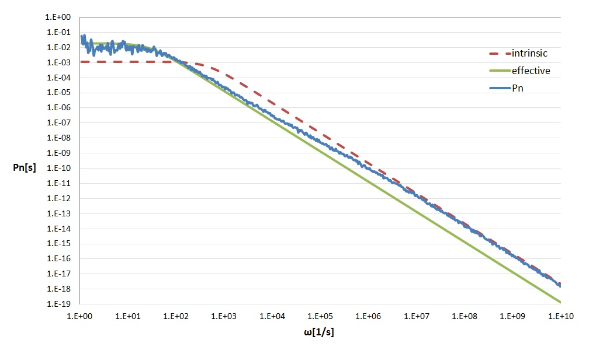

The modern C++ implementation of the eGFRD has been published as an open source package on GitHub. Please follow the [installation instructions]({{site.github_install_instructions}}) on the repository to setup the simulator. Problems can be reported via the eGFRD [issue tracker]({{site.github_issue_tracker}}).

## Examples
To help you getting started, we have assembled some simple models. These can be used to verify the implementation of the code and to build more complex models.

## Equilibrium
Consider a set of particles A, B and C with the following reaction: A + B ⇾ C with binding rate constant k<sub>a</sub> [m<sup>3</sup>/s] and C ⇾ A + B and unbinding rate k<sub>d</sub> [s<sup>-1</sup>]. In a box with length L [m] and periodic boundary conditions, the reaction will relax towards equilibrium. For this system, we can calculate the number of C particles analytically.

<code>N<sub>C_th</sub> = 2 &bull; N + K<sub>D</sub> &bull; V &bull; sqrt[(2 &bull; N + K<sub>D</sub> &bull; V)<sup>2</sup> - 4 &bull; N &bull; N]/2</code>

where N is the number of A and B particles respectively in the volume V = L<sup>3</sup>, and K<sub>D</sub> = k<sub>d</sub>/k<sub>a</sub> is the dissociation constant. To test the eGFRD-simulation a model (equilibrium.gfrd) is provide that sets up this scenario and starts with zero C particles. After some time the number of C particles should approach the calculated equilibrium N<sub>C_th</sub>. To run this model:

```
./RunGfrd ../../samples/equilibrium/equilibrium.gfrd
```

The output of the program shows average amount of particles at intervals of 1 second. The number of C particles should be readily increasing and after reaching equilibrium will fluctuate around the calculated N<sub>C_th</sub>. Press Ctrl-C to end the simulation.

As a additional check the unbinding rate k<sub>d</sub> can be changed to a higher value decreasing the average number of C particles in equilibrium. This can be done by editing the model-file in a text-editor or by defining the value k<sub>d</sub> on the commandline:

```
./RunGfrd ../../samples/equilibrium/equilibrium.gfrd -d kd=8e-2
```


## Power Spectrum
Besides the dissociation constant, it may also prove useful to compute the power spectrum of the simple association-dissociation reaction. The provided model powerspectrum.gfrd sets up the simulator with the same parameters as in the paper of Kaizu et. al. \[[1](#references)\]:

```
./RunGfrd ../../samples/powerspectrum/powerspectrum.gfrd
```

The powerspectrum needs to be calculated from the time-codes in the power_rec.dat file. This can be done with <TODO>


<p align="center"></p>
<div style="margin:auto;width:75%;text-align:center;font-style:italic">
Fig.1: Results of the power spectrum simulation, which agree well with the theoretical predictions.
</div>

## MAPK
The Mitogen-Activated Protein Kinase (MAPK) cascade is one of most studied and best characterized signalling pathways in biology. The cascade consists of three layers, where in each layer a protein is phosphorylated at two states. The application of eGFRD to one layer showed that fluctuations at the molecular scale can dramatically change the macroscopic behavior at the cellular scale \[[2](#references)\]. With the new eGFRD package the MAPK simulation can be easily set up using:
```
./RunGfrd ../../samples/mapK/mapK.gfrd
```

## Custom
Users can use the package to set up their own model by creating their a new gfrd-file. This can be from scratch, or copy one of the samples as a starting point. See [documentation](https://github.com/gfrd/moderen_egfrd/doc/notes on model-files).

```
.\RunGfrd user-file.gfrd
```

When the model-language is too restricted or you're just more confident writing C++ code, it is also possible to do just that. As an staring point the [SimCustom.hpp](https://github.com/gfrd/moderen_egfrd/src/RunGfrd/SimCustom.hpp) is your place. To start you custom simulator type:

```
.\RunGfrd --custom
```


## Resume

The simulator (when enabled) will write it's internal state to a file at every maintanance step (usually the maintanance step is is high number like 100000 or 1000000). In the unfortunate event that something goes wrong (unexpected termination) the state file can be used to resume simulation. This is espacially usefull when the simulater crashes after days of calculating and you now need to debug that error. 

```
.\RunGfrd --resume sim_state.dat
```


## Sample model file: resume.gfrd


```
; eGFRD rebinding simulation

[Simulator]
           Seed = 0x1234CAFE
        EndTime = 90.0                 ; sec.
MaintenanceStep = 100000
MaintenanceFile = sim_dump.out

[World]
Matrix = 8
  Size = 3.42e-6                      ; 40 femto Liter = 4e-17 m3

[CopyNumbers]
Interval = 1E-1
    File = copy_num.out
    Type = Instantaneous

[SpeciesType]
Name = A B C
   r = 1e-9                            ; m
   D = 1e-12                           ; m^2*s^-1

[ReactionRule]
Rule = A + B <=> C
  ka = 1e-19                           ; m^3*s^-1
  kd = 2e-2                            ; s^-1

[Particles]
A = 100
B = 100
C = 0
```

## References
1. Kaizu K, de Ronde W, Paijmans J, Takahashi K, Tostevin F, ten Wolde PR (2014) The Berg-Purcell Limit Revisited Biophys J, 106:976-985. ([doi](https://dx.doi.org/10.1016/j.bpj.2013.12.030))
2. Takahashia K, Tănase-Nicolad S, ten Wolde PR (2009) Spatio-temporal correlations can drastically change the response of a MAPK pathway ([doi](https://dx.doi.org/10.1073/pnas.0906885107))
